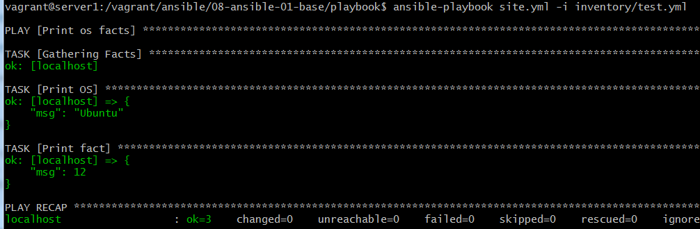
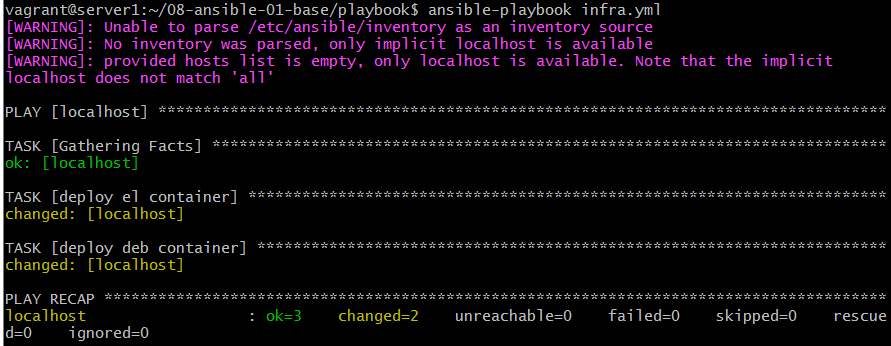
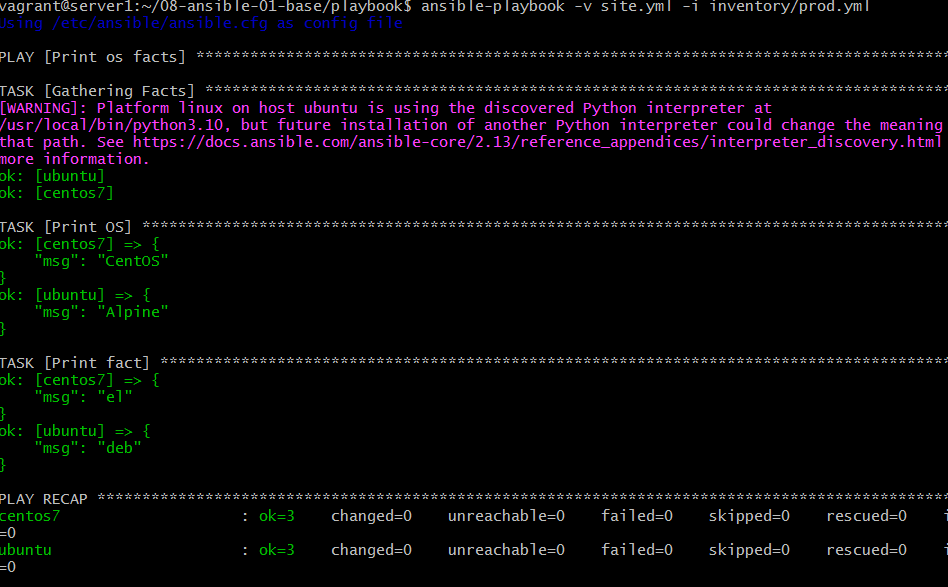
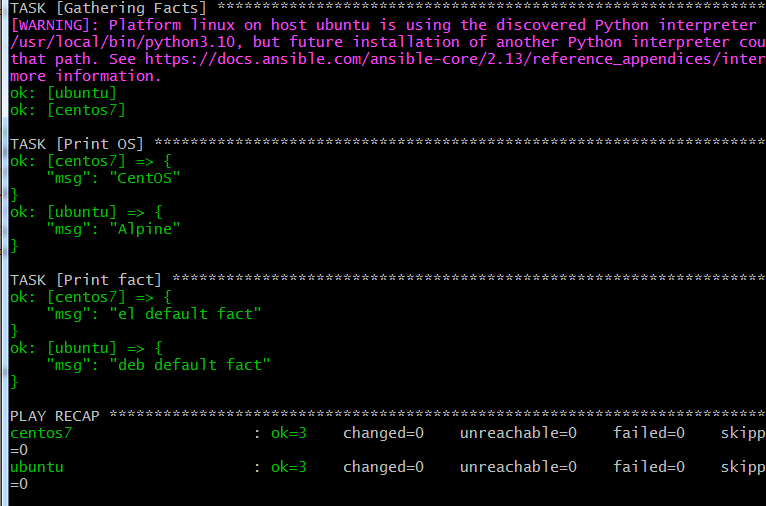
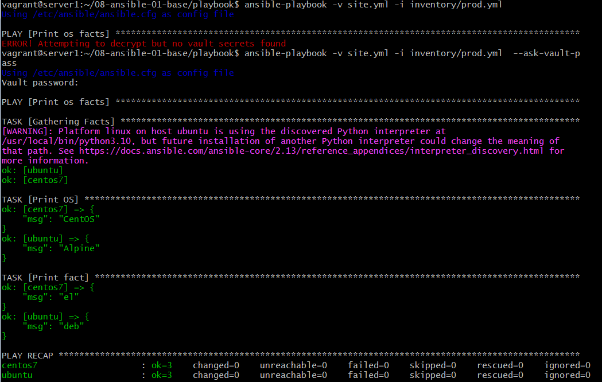
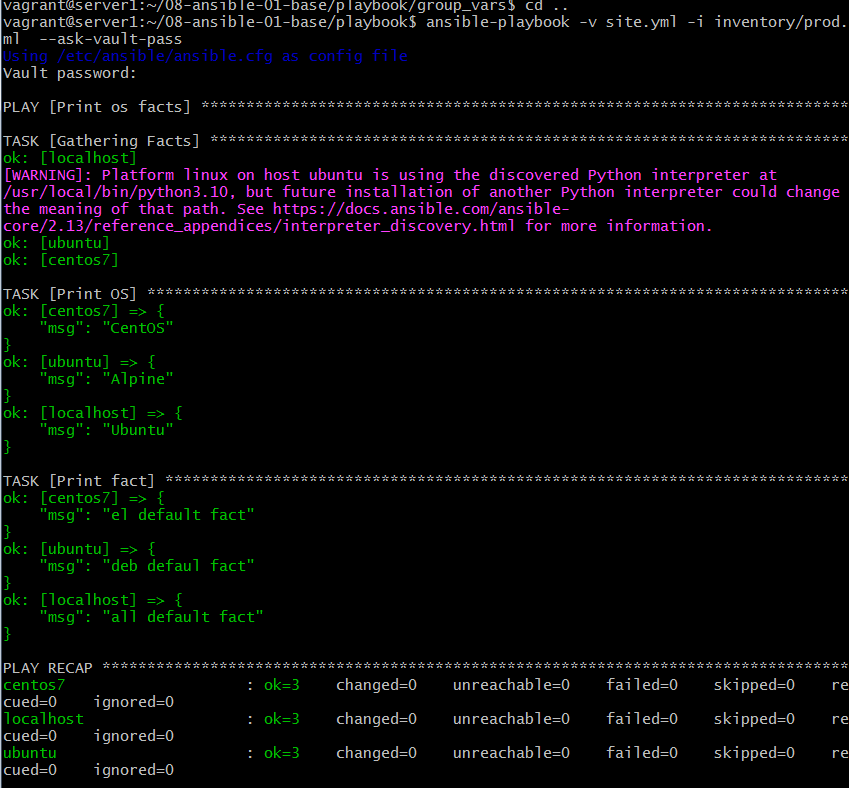
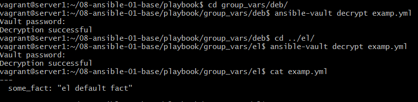
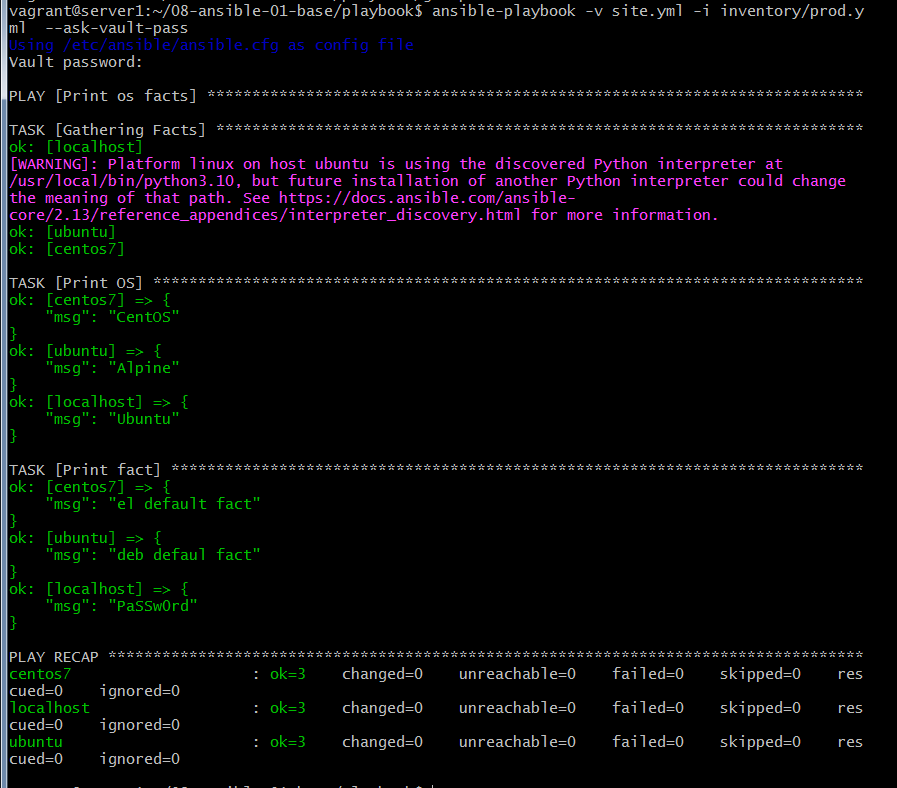

# Домашнее задание к занятию "08.01 Введение в Ansible"

## Подготовка к выполнению
1. Установите ansible версии 2.10 или выше.

   стояла старая версия, обновил через `python3 -m pip install --upgrade --user ansible`

2. Создайте свой собственный публичный репозиторий на github с произвольным именем.
3. Скачайте [playbook](./playbook/) из репозитория с домашним заданием и перенесите его в свой репозиторий.

   клонировал весь репо с дз https://github.com/korsh84/mnt-homeworks


## Основная часть
1. Попробуйте запустить playbook на окружении из `test.yml`, зафиксируйте какое значение имеет факт `some_fact` для указанного хоста при выполнении playbook'a.



2. Найдите файл с переменными (group_vars) в котором задаётся найденное в первом пункте значение и поменяйте его на 'all default fact'.

    файл \group_vars\all\examp.yml

```yaml
---
  some_fact: "all default fact"
```

3. Воспользуйтесь подготовленным (используется `docker`) или создайте собственное окружение для проведения дальнейших испытаний.

    я не нашел подготовленного окружения, попробовал поднять сам с помощью ansible через отдельный playbook. Почему при использовании образа ubuntu была ошибка с отсутствием python, поэтому использовал `python:3-alpine` параметр tty - чтобы контейнер не останавливался.

```infra.yml
---
- hosts: localhost
  connection: local
  tasks:
    - name: deploy el container
      docker_container:
        image: centos:7
        name: centos7
        state: started
        auto_remove: false
        network_mode: host
        tty: true
    - name: deploy deb container
      docker_container:
        image: python:3-alpine
        name: ubuntu
        state: started
        auto_remove: false
        network_mode: host
        tty: true
```   

   

4. Проведите запуск playbook на окружении из `prod.yml`. Зафиксируйте полученные значения `some_fact` для каждого из `managed host`.



5. Добавьте факты в `group_vars` каждой из групп хостов так, чтобы для `some_fact` получились следующие значения: для `deb` - 'deb default fact', для `el` - 'el default fact'.

> правим файлы examp.yml

6.  Повторите запуск playbook на окружении `prod.yml`. Убедитесь, что выдаются корректные значения для всех хостов.



7. При помощи `ansible-vault` зашифруйте факты в `group_vars/deb` и `group_vars/el` с паролем `netology`.

   используем команду `ansible-vault encrypt examp.yml` в соответствующей директории

8. Запустите playbook на окружении `prod.yml`. При запуске `ansible` должен запросить у вас пароль. Убедитесь в работоспособности.

    необходима опция при запуске `--ask-vault-password` иначе ошибка  `ERROR! Attempting to decrypt but no vault secrets found`

	

	зашифровал случайно исходные версии examp.yml , когда добавлял localhost поправил их снова

9. Посмотрите при помощи `ansible-doc` список плагинов для подключения. Выберите подходящий для работы на `control node`.

    не очень понял задание, команда `ansible-doc -l` выдает весь список плагинов, но их там очень много. мы используем `docker_container`
```
vagrant@server1:~/08-ansible-01-base/playbook$ ansible-doc docker_container
> COMMUNITY.DOCKER.DOCKER_CONTAINER    (/home/vagrant/.local/lib/python3.8/site-packages/ansible_collect>
```

10. В `prod.yml` добавьте новую группу хостов с именем  `local`, в ней разместите localhost с необходимым типом подключения.

```
  local:
    hosts:
      localhost:
        ansible_connection: local
```

11. Запустите playbook на окружении `prod.yml`. При запуске `ansible` должен запросить у вас пароль. Убедитесь что факты `some_fact` для каждого из хостов определены из верных `group_vars`.



12. Заполните `README.md` ответами на вопросы. Сделайте `git push` в ветку `master`. В ответе отправьте ссылку на ваш открытый репозиторий с изменённым `playbook` и заполненным `README.md`.


## Необязательная часть

1. При помощи `ansible-vault` расшифруйте все зашифрованные файлы с переменными.

    основная команда `ansible-vault decrypt examp.yml`



2. Зашифруйте отдельное значение `PaSSw0rd` для переменной `some_fact` паролем `netology`. Добавьте полученное значение в `group_vars/all/exmp.yml`.

```
  cd group_vars/all
  ansible-vault create passvar.yml
```  
```passvar.yml  
	some_fact: "deb defaul fact"
```
```all/exmp.yml  
---
  include_vars:
    file: passvar.yaml
```


3. Запустите `playbook`, убедитесь, что для нужных хостов применился новый `fact`.



4. Добавьте новую группу хостов `fedora`, самостоятельно придумайте для неё переменную. В качестве образа можно использовать [этот](https://hub.docker.com/r/pycontribs/fedora).

    правил свой файл для ansible

```infra.yml
...
    - name: deploy fedora container
      docker_container:
        image: pycontribs/fedora
        name: fedora
        state: started
        auto_remove: false
        network_mode: host
        tty: true
```   	

5. Напишите скрипт на bash: автоматизируйте поднятие необходимых контейнеров, запуск ansible-playbook и остановку контейнеров.

```1.sh
#!/bin/bash
ansible-playbook infra.yml --ask-vault-password
#ansible-playbook -v site.yml -i inventory/prod.yml
ansible-playbook -v site.yml -i inventory/prod.yml --ask-vault-password

docker stop ubuntu centos7 fedora
#docker rm ubuntu centos7 fedora
```

6. Все изменения должны быть зафиксированы и отправлены в вашей личный репозиторий.

---

### Как оформить ДЗ?

Выполненное домашнее задание пришлите ссылкой на .md-файл в вашем репозитории.

---
