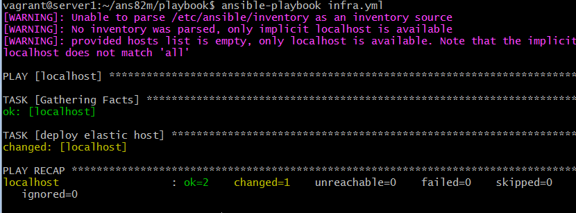
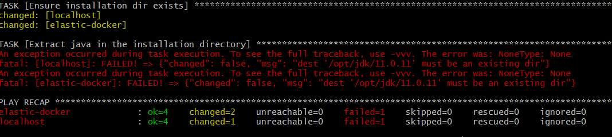
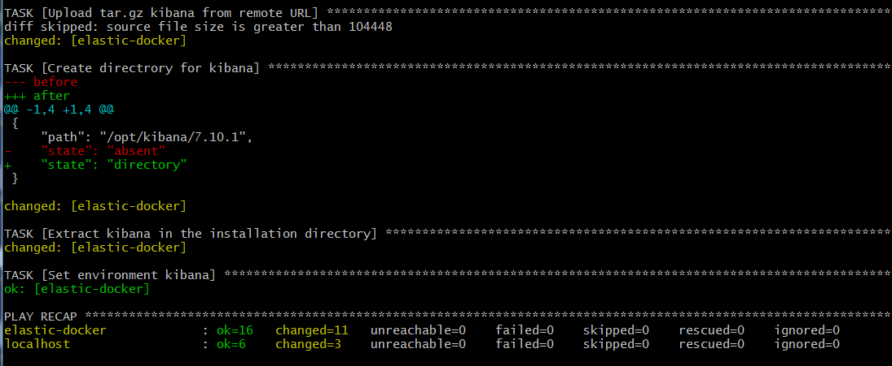
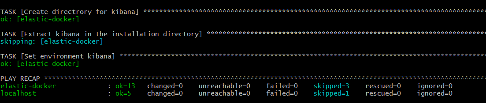

# Домашнее задание к занятию "08.02 Работа с Playbook"

## Подготовка к выполнению
1. Создайте свой собственный (или используйте старый) публичный репозиторий на github с произвольным именем.
2. Скачайте [playbook](./playbook/) из репозитория с домашним заданием и перенесите его в свой репозиторий.
3. Подготовьте хосты в соотвтествии с группами из предподготовленного playbook. 

```infra.yml
- hosts: localhost
  connection: local
  tasks:
    - name: deploy elastic host
      docker_container:
        image: centos:7
        name: elastic-docker
        state: started
        auto_remove: true
        network_mode: host
        tty: true
```
> $ ansible-playbook infra.yml

  


4. Скачайте дистрибутив [java](https://www.oracle.com/java/technologies/javase-jdk11-downloads.html) и положите его в директорию `playbook/files/`. 

## Основная часть
1. Приготовьте свой собственный inventory файл `prod.yml`.

```prod.yml
---
  elasticsearch:
    hosts:
      elastic-docker:
        ansible_connection: docker
  local:
    hosts:
      localhost:
        ansible_connection: local
# для local требуется become, для docker контейнера не требуется
        become: true
```

2. Допишите playbook: нужно сделать ещё один play, который устанавливает и настраивает kibana.
3. При создании tasks рекомендую использовать модули: `get_url`, `template`, `unarchive`, `file`.
4. Tasks должны: скачать нужной версии дистрибутив, выполнить распаковку в выбранную директорию, сгенерировать конфигурацию с параметрами.

   все продукты elastic и java недоступны для скачивания без vpn, предварительно все скачал и использовал copy. Ниже привел tasks для kibana. В j2 шаблон добавил установку переменных kibana

```site.yml
- name: Install kibana
  hosts: elasticsearch
  tasks:
    - name: Copy tar.gz kibana 
      copy:
        src: "kibana-{{ elastic_version }}-linux-x86_64.tar.gz"
        dest: "/tmp/kibana-{{ elastic_version }}-linux-x86_64.tar.gz"
      register: get_kibana
      until: get_kibana is succeeded
      tags: kibana
    - name: Create directrory for kibana
      file:
        state: directory
        path: "{{ kibana_home }}"
      tags: kibana
    - name: Extract kibana in the installation directory
      unarchive:
        copy: false
        src: "/tmp/kibana-{{ elastic_version }}-linux-x86_64.tar.gz"
        dest: "{{ kibana_home }}"
        extra_opts: [--strip-components=1]
        creates: "{{ kibana_home }}/bin/kibana"
      tags:
        - kibana
    - name: Set environment kibana
     template:
        src: templates/elk.sh.j2
        dest: /etc/profile.d/elk.sh
      tags: kibana

```   

```elk.sh.j2
export KIBANA_HOME={{ kibana_home }}
export PATH=$PATH:$KIBANA_HOME/bin
```

5. Запустите `ansible-lint site.yml` и исправьте ошибки, если они есть.

   было 3 типа ошибок:
    - fqcn-builtins: Use FQCN for builtin actions.
      
	  требуется замена команд типа `copy` на ` ansible.builtin.copy`  и т.п.
    
	- risky-file-permissions: File permissions unset or incorrect.

       для каждой операции с файлами требуется прописывать права например `mode: '644'`
	   
	- yaml: wrong indentation: expected 8 but found 9 (yaml[indentation])
	   
	   ошибки в числе пробелов в исходном prod.yml

6. Попробуйте запустить playbook на этом окружении с флагом `--check`.

 > $ ansible-playbook --check site.yml -i inventory/prod.yml
 
   были ошибки, поскольку файлы еще не скопированы и директории нет

  

7. Запустите playbook на `prod.yml` окружении с флагом `--diff`. Убедитесь, что изменения на системе произведены.
   
   tasks отработали.
   
     

8. Повторно запустите playbook с флагом `--diff` и убедитесь, что playbook идемпотентен.

   tasks отработали. Изменений не было.
   
     


9. Подготовьте README.md файл по своему playbook. В нём должно быть описано: что делает playbook, какие у него есть параметры и теги.
10. Готовый playbook выложите в свой репозиторий, в ответ предоставьте ссылку на него.

## Необязательная часть

1. Приготовьте дополнительный хост для установки logstash.
2. Пропишите данный хост в `prod.yml` в новую группу `logstash`.
3. Дополните playbook ещё одним play, который будет исполнять установку logstash только на выделенный для него хост.
4. Все переменные для нового play определите в отдельный файл `group_vars/logstash/vars.yml`.
5. Logstash конфиг должен конфигурироваться в части ссылки на elasticsearch (можно взять, например его IP из facts или определить через vars).
6. Дополните README.md, протестируйте playbook, выложите новую версию в github. В ответ предоставьте ссылку на репозиторий.

---

### Как оформить ДЗ?

Выполненное домашнее задание пришлите ссылкой на .md-файл в вашем репозитории.

---
